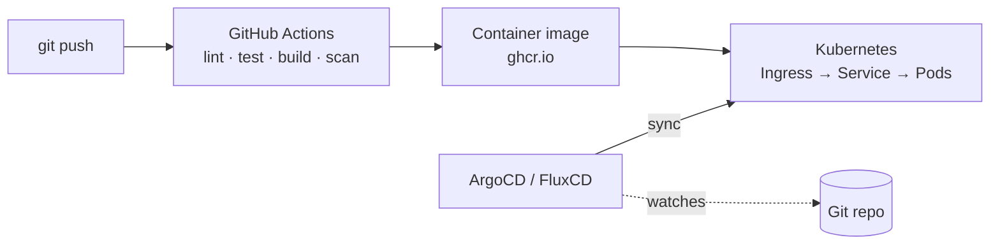

# Hrishabh Shah — Developer Portfolio

[](https://github.com/Hrishabhshah006/Portfolio/actions/workflows/ci.yml)

A responsive, single-page personal portfolio built with React, TypeScript, and Vite —
and shipped through a complete, production-style DevOps pipeline: containerized with
Docker, tested and security-scanned in CI, and deployable to Kubernetes via GitOps.

## Highlights

- **Modern frontend** — React 18 + TypeScript, Vite build, Tailwind CSS, and
  accessible [shadcn/ui](https://ui.shadcn.com) components (Radix primitives).
- **Dark / light theming** — custom React Context with `localStorage` persistence and
  system-preference detection.
- **Fully automated CI/CD** — GitHub Actions pipeline: `lint → test → build → docker`,
  with image build, vulnerability scanning, and publish to GitHub Container Registry.
- **Container-first** — multi-stage Docker build serving a static bundle via NGINX,
  hardened to **0 known CVEs** (OS packages patched at build time).
- **Kubernetes-ready** — Deployment, Service, Ingress, and HPA manifests with health
  probes and resource limits.
- **GitOps** — ArgoCD and FluxCD manifests to continuously sync the cluster from Git.

## Tech Stack

| Area | Technologies |
|------|-------------|
| Frontend | React 18, TypeScript, Vite, React Router |
| Styling | Tailwind CSS, shadcn/ui, Radix UI, lucide-react |
| Testing | Vitest, React Testing Library, coverage (v8) |
| Container | Docker (multi-stage), NGINX |
| CI/CD | GitHub Actions, Trivy (image scanning), GHCR |
| Orchestration | Kubernetes (Deployment, Service, Ingress, HPA) |
| GitOps | ArgoCD, FluxCD |

## Architecture



## Getting Started

**Prerequisites:** [Node.js](https://nodejs.org) 20+ and npm.

```sh
# Clone and enter the project
git clone https://github.com/Hrishabhshah006/Portfolio.git
cd Portfolio

# Install dependencies
npm install

# Start the dev server (http://localhost:8080)
npm run dev
```

### Available Scripts

| Command | Description |
|---------|-------------|
| `npm run dev` | Start the dev server with hot reload |
| `npm run build` | Production build to `dist/` |
| `npm run preview` | Preview the production build locally |
| `npm run lint` | Run ESLint |
| `npm run test` | Run the unit test suite |
| `npm run test:coverage` | Run tests with a coverage report |

## Testing

Unit tests use **Vitest** and **React Testing Library** (jsdom environment).

```sh
npm run test            # run once
npm run test:watch      # watch mode
npm run test:coverage   # with coverage report (coverage/)
```

## Docker

The app is packaged as a multi-stage image: a Node stage builds the static site, and a
minimal NGINX stage serves it (SPA-aware routing, gzip, asset caching). OS packages are
patched at build time, keeping the final image at **0 known CVEs**.

```sh
# Build and run
docker build -t portfolio .
docker run -p 3000:80 portfolio          # http://localhost:3000

# Or with Docker Compose
docker compose up --build
```

## CI/CD Pipeline

Every push and pull request to `main` runs a staged GitHub Actions pipeline:

1. **Lint** — ESLint.
2. **Test** — Vitest with coverage (uploaded as an artifact).
3. **Build** — production Vite build.
4. **Docker** — build the image, scan it with **Trivy** (fails on fixable
   Critical/High CVEs), and push to GitHub Container Registry on `main`.

## Running on Kubernetes (local `kind` cluster)

The `k8s/` folder contains manifests (Deployment, Service, Ingress, HPA) to run the
containerized app on Kubernetes. You can try it locally with a free
[kind](https://kind.sigs.k8s.io/) cluster — no cloud account required.

**Prerequisites:** [Docker](https://docs.docker.com/get-docker/),
[kind](https://kind.sigs.k8s.io/docs/user/quick-start/#installation), and
[kubectl](https://kubernetes.io/docs/tasks/tools/).

```sh
# 1. Create a local cluster
kind create cluster --name portfolio

# 2. Install the NGINX ingress controller (needed for the Ingress)
kubectl apply -f https://raw.githubusercontent.com/kubernetes/ingress-nginx/main/deploy/static/provider/kind/deploy.yaml
kubectl wait --namespace ingress-nginx \
  --for=condition=ready pod \
  --selector=app.kubernetes.io/component=controller \
  --timeout=90s

# 3. Deploy the app (applies everything via kustomization.yaml)
kubectl apply -k k8s/

# 4. Check that it is running
kubectl get all -n portfolio
kubectl get ingress -n portfolio
```

Map the ingress host to localhost, then open the site:

```sh
echo "127.0.0.1 portfolio.local" | sudo tee -a /etc/hosts
# visit http://portfolio.local
```

**Tear down when done:**

```sh
kind delete cluster --name portfolio
```

> Note: the image `ghcr.io/hrishabhshah006/portfolio:latest` must be public for the
> cluster to pull it (GitHub → Packages → portfolio → make public), or configure an
> image pull secret.

## GitOps (ArgoCD / FluxCD)

Instead of running `kubectl apply` manually, a GitOps controller can watch this repo
and keep the cluster continuously in sync with the `k8s/` folder.

- **ArgoCD** — [`gitops/argocd/application.yaml`](gitops/argocd/application.yaml)
- **FluxCD** — [`gitops/flux/portfolio.yaml`](gitops/flux/portfolio.yaml)

Both point at the same `k8s/` manifests, with auto-sync, pruning, and self-healing
(the cluster reverts any manual drift back to what is committed in Git).

## Project Structure

```
├── src/                 # React application (components, pages, hooks, lib)
├── k8s/                 # Kubernetes manifests (Deployment, Service, Ingress, HPA)
├── gitops/              # ArgoCD and FluxCD sync manifests
├── .github/workflows/   # CI/CD pipeline
├── Dockerfile           # Multi-stage build (Node → NGINX)
├── docker-compose.yml   # Local container orchestration
└── nginx.conf           # SPA-aware NGINX config
```

## Contact

**Hrishabh Shah** —
[GitHub](https://github.com/hrishabhshah006) ·
[LinkedIn](https://linkedin.com/in/hrishabhshah) ·
hrishabhshah006@gmail.com

